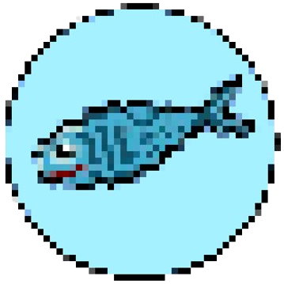

# [WaterFish | One web, one world, one flow](info.html)

---



---

Water-Fish - lightweight, tkinter based, web browser.
It is an alternative, experimental web browser made after I heard about the recent privacy discussions about major browsers.
Made as a way to explore the question "What if...I just make my own browser?".
It is very privacy focused, and we assure you that:

1. Water-Fish will not collect and store ANY user data on servers.
2. Water-Fish will remain fully open-source.
3. Water-Fish will be free for everyone with access to all features, no premium or pro versions.
4. Water-Fish will not implement Machine Learning, nor will it collect user data to train AI's.

Please do note water fish is currently in ***BETA*** which means there are some lack of features.
More info below.

Oh btw, the search engine used is [here](https://wiby.me/).

---

## More info

<details>
<summary>Bugs</summary>
There are a lot of bugs. First off, you can't really download anything from the browser and, more obviously, there’s no JS support.
</details>

<details>
<summary>Lack of</summary>
It's own actual rendering engine, and full js/css support.
</details>

<details>
<summary>Contribute to Water-Fish development</summary>

CONTRIBUTING.md is [here](CONTRIBUTING.md).

</details>

## Project Structure
```
Water-Fish/
├── main.py
├── README.md
├── CONTRIBUTING.md
├── Requirements.txt
├── info.html

├── images/
│   ├── waterfish.ico
│   ├── waterfish.png

├── system/
│   ├── settings.txt

├── audio/
│   ├── rickroll.mp3

├── wfmodules/
│   ├── Welcome.py
│   ├── secrets.py
│   ├── history.py
│   ├── command.py
│   ├── checkonline.py
```

**Starting update 3.0 most new features would be added on to wfmodules as main.py file is getting too big and messy**
